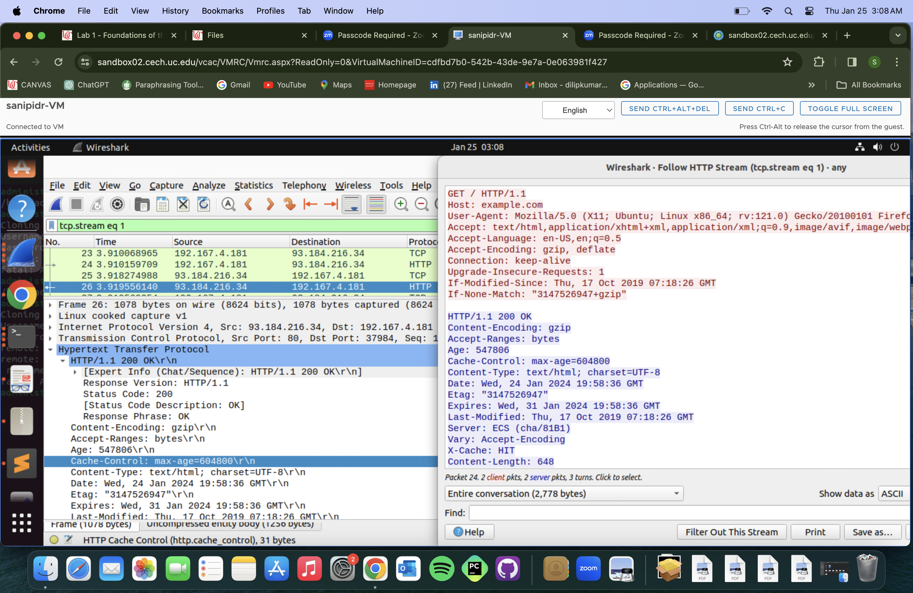

# waph-sanipidr
  WAPH-Web Application Programming and hacking

## **Instructor** : Dr.Phu Phung 


**Name**: DILIP KUMAR SANIPINA

**Email** : sanipidr@mail.uc.edu

**Short-bio** : I have very interested in web programming and ethical hacking .


Respository's URL: https://github.com/sanipidr/waph-sanipidr.git

## Lab 1 - Foundation of the web
In this lab1 excercise we have done the two parts of the HTTP protocal. 
Part-1: Is about the gaining the hands-on experience with the wireshark tool and the telnet. understanding the HTTP communication familiar with the HTTP Get Request and response. 
Part-2: the second part is about the fundamentals of the web development. This part covers the web application programming in C  and the Common Gateway interface. Gained a insights on how the web-application funtions.Creating the simple web applicatiion using PHP. getting the user input to get the complete understanding about the HTTP GET and POST requests.
From this lab1 hands-on experience gained practical expeerience with the essential tools and acquire a foundational knowledge of web application development and HTTP protocols 

Github URL: https://github.com/sanipidr/waph-sanipidr.git

# PART-1 : HTTP PROTOCOL

# TASK-1: Familiar with the wireshark tool and HTTP protocol
Firstly,installed the wireshark tool on the Ubuntu VM.wireshark is a network packet. click the start button in the wireshark tool and open the google chrome and search the website http://example.com/index.html. go back to the wireshark and click the stop function. filter the data with http. click on the GET to get the http request message and on the response message  to get the http response message. to get the http stream right click on the packet and follow http stream will display.


## TASK-2 : Understanding http using telnet and wireshark
1.Telnet is a network application implementing the telnet protocol. it is used to make a tcp connection to a server for sending and receiving the data server.
Firstly,connecting to the webserver at port 80 and a valid http request typed manually within the telnet application and we will get the response.By analyzing we will get the http request and http response.


2.Get Requests typed directy in Telnet are like basic text message which are very short.Get Requests sent by the browser are in-detail with more information like details about the browser and the past activity. about the pacakage and addresses.



3.The information sent and received between the server and the client using the web browser and telnet.The main keydifference is telnet doesn't encrypt the data.for example the information which is sent through telnet is simple text based which is not scecure.The information sent through browser which is is encode format it is private and secure.In telnet we cannot protect data during communication.

## PART-2 : BASIC WEB APPLICATION PROGRAMMING

### TASK 1: CGI WEB APPLICATION IN C 

a.Created a HelloWorld program in C and compiled by installing a gcc compiler.run it as a regular binary program $ gcc helloworld.c -o helloworld.cgi.CGI programs that can directly  run on the operating systems stored in /usr/lib/cgi-bin.we should copy cgi progra to this folder and the cgi application will be executed by the web browser.the cgi application output is sent as a content of Http response.

- source code: `helloworld.c`
 ```c
  #include <stdio.h>
  int main(void) {
  printf("Content-Type: text/plain; cahrset = utf-8\\n");
  printf("Hello World CGI! From DILIP KUMAR SANIPINA,WAPH\\n\n");
  return 0;
  }
   ```


b.Firstly,copy the helloworld.c program in the same folder and named it as a index.c. used CGI applications written in C to create dynamic web pages.combining the C code with the regular HTML tags to generate the content that are based on the user input.we need to include special line in C code : "Content-Type:text or html".This code will give the output as the HTML.To run this code as a CGI application we need to follow the same steps as we followed in helloworld.cgi program.

- source code: `index.c`
  ```html
  	#include<stdio.h>
  	int main(void) {
  	printf("Content-Type: text/html; cahrset = utf-8\\n\n");
  		printf("<!DOCTYPE html>\n");
  		printf("<html>\n");
  		printf("<head>\n");
  		printf("<title>Lab 1 PART 2</title>\n");
  		printf("</head>\n");
  		printf("<body>\n");
  		printf("<h1>TOPICS IN COMPUTER SYSTEMS</h1>\n");
  		printf("<p>DILIP KUMAR SANIPINA</p>\n");
  		printf("</body>\n");
  		printf("</html>\n");
  		return 0;

  	}
  	``` 


# TASK-2 : A Simple Web Application with user input in PHP

a.PHP is a scripting programming language.Firstly we need to install the PHP and configure to work with the Apache Web Server.Created a new file name as a helloworld.php in the repository. wrote the helloworld code in PHP we use the echo in the code which represents the language construct in PHP to print out the strings from texts to expressions.and deploy the php code to the webserver root directory by $ sudo cp helloworld.php /var/www/html and the deployed page is accessible from the browser.

- source code: helloworld.php

<?php
	echo "Hello world,this is the first PHP by DILIP KUMAR SANIPINA,WAPH";
	phpinfo():
?>


b.Printing out the any input from the user nown as the echo web application.Creating a new echo.php file and write the code using the $_REQUEST it is a global variable to get input data from a http request including GET or POST.Deploy the code to the webserver Root directory $ sudo cp echo.php / var/www/html.browse the page with the input data in the URL.
<?php
	echo $_REQUEST["data"];
?>


The code 'echo.php' is not secure because it doesn't check properly and validate the input it receives.it leads to the malware attacks users can manipulate the input for illegal purposes.Additionally the code doesn't adequetly protect aganist Cross-Site scripting(XSS) attacks,This allow attackers to run malicious scripts in user browser.The code uses '$_REQUESTS' in programming allows data to come from different places,including user inputs from the URL.However,if this input is not checked or cleaned properly,it could be tampered with the risk to the website or app.   

## PART 3: UNDERSTANDING HTTP GET AND POST REQUESTS
a.Launch Wireshark from the terminal and open the.php file in the local browser.once the php application finished its actions.stop the packet capture in wireshark.In wireshark we should use the filter http for HTTP GET request and response.


b.We need to install the curl first to test the echo.php page using a POST request with input data $curl -X POST [URL] -d [fieldname=input]. In the input field we can provide our data and we will get the related data content from the HTTP response.


C.HTTP GET and POST requests are two ways to fetch information from the websites,but they will handle the data seperately.GET requests are userinputs are part of website addressitself.Data is included in the search query.while POST requests user input is sent seperately using the tool like "curl" and the data is not visible in the website address making it more secure for sensitive information.
The response from the website look very similar for both type of requests.the content you see on the webpage is same,no matter which method is used.