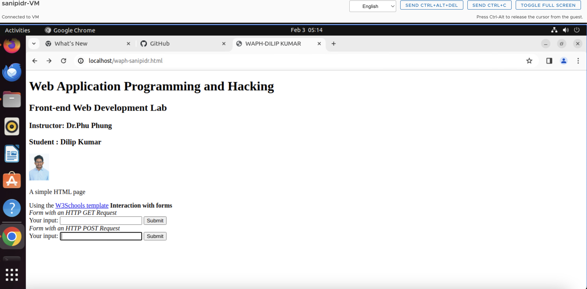
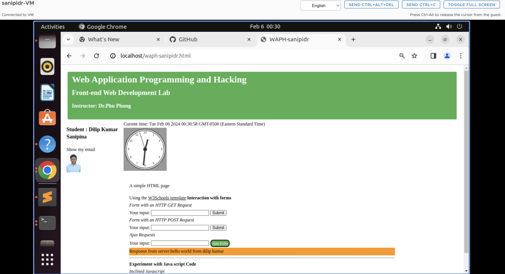

# waph-sanipidr
  WAPH-Web Application Programming and hacking

## **Instructor** : Dr.Phu Phung 


**Name**: DILIP KUMAR SANIPINA

**Email** : sanipidr@mail.uc.edu

**Short-bio** : I have very interested in web programming and ethical hacking .


Respository's URL:[https://github.com/sanipidr/waph-sanipidr/tree/main/labs/lab2](https://github.com/sanipidr/waph-sanipidr/tree/main/labs/lab2)

## Lab 2 : FRONT-END WEB DEVELOPMENT
In this lab2 excercise we have done the two tasks of front-end web development. 
Task-1: We have developed a HTML file with the basic tags and forms like HTTP GET Request and POST Request.By using java Script code to display the current date and time,digital clock,show email,analog clock. 
Task-2: we have done the Ajax and the HTML code for the user input.get the user input when the new button is clicked.create and send an AJAX GET REQUEST to echo.php web application.
we have added the CSS to the web page.By using JQUERY we will get the AjaxGet Request to display the content.
We have done the Web API Integration using Ajax to display a random joke and by using fetch API to get the age.


## Task-1: Basic HTML With, JavaScript and Forms
- **a.HTML**
- The Html page consists of the Student name "Dilip Kumar Sanipina".The subject name and teh instructor of the subject.this entire page was built was using the simple HTML structure taken from W3school website.This task includes the Introduction section contains the title,headers and menu bar.It has a forms section containing two seperate forms.One is GET request and the other is Post.Both forms contain the Input button.the webpage is clear and easy to navigate. <br>




- **b.Simple Javascript**

- source code: `SIMPLE JAVA SCRIPT `

 ```html
    <!DOCTYPE html>
  <html>
  <head>
  <meta charset="utf-8">
  <title>WAPH-sanipidr</title>
  </head>
  <body>
      <div class="wrapper">
      <div id="menubar">
          <h3>Student: DILIP KUMAR SANIPINA</h3>
          <div id="email" onclick="showhideEmail()">Show my email</div>
          <script src="Email.js"></script>
  <div class="container wrapper">    
      <div id="top">
          <h1>Web Application Programming and Hacking</h1>
          <h2>Front-end Web Developement Lab</h2>
          <h3>Instructor: Dr.Phu Phung</h3>
      </div>
          
      </div>    
      <div id="digital-clock"></div>
      <div id="digital-clock"></div>
      <canvas id="analog-clock" width="150" height="150" 
      style="background-color:#999"></canvas>
      <script src="https://waph-uc.github.io/clock.js"></script>
      <script type="text/JavaScript">
              function displayTime() {
                      document.getElementById('digital-clock').
                      innerHTML ="Current time:" + new Date();}
              setInterval(displayTime,500);
              var canvas = document.getElementById("analog-clock");
              var ctx = canvas.getContext("2d");
              var radius = canvas.height / 2;
              ctx.translate(radius,radius);
              radius = radius *0.90
               }            
      </script>    
      </div>
      <div id="main">
          <p>A Simple HTML Page</p>
          Using the <a href="https://www.w3schools.com/html" 
          target= "_blank"> W3Schools template</a>
          <hr> 
          <b>Interaction with forms</b>
          <div>
              <i>Form with an HTTP GET Request</i>
              <form action="/echo.php" method="GET">
                  your input: <input name="data">
                  <input type="submit" value="Submit" formtarget="_blank">
              </form>    
          </div>
          <div>
              <i>Form with an HTTP POST Request</i>
              <form action="/echo.php" method="POST" name="echo_post">
                  your input: <input name="data"
                              onkeypress="console.log
                              ('you have pressed a Key')">
                  <input type="submit" value="Submit" formtarget="_blank">
              </form>    
          </div>
          <b> Experiments with JavaScript Code</b>
          <br>
          <i> Inlined JavaScript</i>
          <div id="date" onclick="document.getElementById('date')
          .innerHTML=Date()">Click here to show Date()</div>
          <hr>
      </div> 
  </div>   
  </body>
  </html>
  ```

 **1.Inline JavaScript Code**

  -When we click the part of the page labeled "date",It automatically cahnges to show you the curent date and time.It's like a clock we can update with a click.
  -whenever we type anything in the input box, a message pops up behind the scenes to let the computer know taht we have pressed the key

  - source code : `Inline javascript code`
  ```
  <hr> 
  <b>Experiment with Java script Code</b><br>
  <i>Inclined Javascript</i> 
  <div id="date" onclick="document.getElementById('date').
  innerHTML=Date()">Click here to show date</div>
  ```


**2.Digital clock:**
- A web page has a funtion displaytime().It shows the current date and time.It acts like an clock set for every half second.this displays the clock right on the page.

- source code: `Digital clock `
```
   function displayTime() {
                    document.getElementById('digital-clock')
                    .innerHTML ="Current time:" + new Date();}
            setInterval(displayTime,500);
```

**3.Show/Hide Email:** 
- There's is a part of the webpage "email".onclick event is triggered with it,and showhideEmail() function Associated with it.
- we have implemented a external javascript code for the email.js.

- source code: `Show Email `
``` 
  var shown= false;
  function showhideEmail(){
    if (shown){
      document.getElementById('email').innerHTML = "Show my email";
    shown = false;
    }else{
      var myemail = "<a href='mailto:sanipidr"+ "@" 
      + "mail.uc.edu'> sanipidr"+ "@" + "mail.uc.edu</a>";
      document.getElementById('email').innerHTML=myemail;
      shown=true;
    }
  }
```

**4.Analog Clock:**
- we have triggred the javascript code from the external file clock.js from github file.It draws the analog clock.

- source code: `Analog-Clock `
```
   var canvas = document.getElementById("analog-clock");
            var ctx = canvas.getContext("2d");
            var radius = canvas.height / 2;
            ctx.translate(radius,radius);
            radius = radius *0.90
            setInterval(drawClock,1000);
  ```


## Task 2 - Ajax,CSS,Jquery, and Web API Integration

**a.AJAX**

- The JavaScript function 'getEcho()' is made to gather what a user types into an input field of the webpage.when the user clicks a button called "Ajax Echo" this function triggers.sending the user PHP script 'echo.php' . This is done by adding the user's input to the web address.The Webpage also has a form with an input field and the "Ajax Echo" button,we have to type the input.click the button see the server's response displayed on the page.

- source code: `Ajax`
```JS
   function getEcho(){
                var input = document.getElementById("data").value;
                if (input.length == 0) {
                    return;
                }
                var xhttp = new XMLHttpRequest();
                xhttp.onreadystatechange = function() {
                    if (this.readyState == 4 && this.status == 200) {
                        console.log("Received data="+xhttp.responseText);
                        document.getElementById("response")
                        .innerHTML="Response from server:" + xhttp.responseText;
                            
                    }
                }
```
<br>


**b.CSS:**
- CSS makes the web page looks good.CSS use as a style guide for the web page.CSS code written in the  HTML code.The CSS will add special touches to the specific elements like buttons.All the CSS work together to make the webpage look nice and consistent.<br>

- source code: `Inline CSS`

```CSS
<!DOCTYPE html>
<html>
<head>
<meta cahrset="utf-8">
<title>WAPH-sanipidr</title>
<link rel="stylesheet" href=https://waph-uc.github.io/style1.css>
<style>
  .button{
    background-color: #4CAF50; 
    border: none;
    color: white;
    padding: 5px;
    text-align: center;
    text-decoration: none;
    display: inline-block;
    font-size: 12px;
    margin: 4px 2px;
    cursor: pointer;
  }
  .round {border-radius: 8px;}
  #response {background-color: #ff9800;}
</style>
<script src="https://code.jquery.com/jquery-3.7.1.min.js" 
integrity="sha256-/JqT3SQfawRcv/BIHPThkBvs0OEvtFFmqPF/lYI/Cxo=
" crossorigin="anonymous"></script>
</head>
<body>
<div class="container wrapper"> 
<div id="top">
  <h1>Web Application Programming and Hacking</h1>
  <h2>Front-end Web Development Lab</h2>
  <h3>Instructor: Dr.Phu Phung</h3>
 </div>
  <div class="wrapper">
```




**c.JQUERY**

- The code Contains two functions: 'getJqueryAjax()' and 'getJqueryAjaxPost()'.Theeeeey use JQuery to handle Ajax Requests.
- The 'getJqueryAjax()' function takes the user input from the element with the id "data",send it to a file called "echo.php" using a GET request,and then displays the response from the server using the 'printResult()' function.
- Similarly,the 'getJqueryAjaxPost()' function does the same thing but with a POST request instead of a GET request.

- source code: `Jquery Get`
```JS 
   function jQueryAjax() {
                    var input = $("#data").val();
                    if (input.length == 0) return;
                    $.get("echo.php?data="+input,
                            function(result) {
                                $("#response")
                                .html("Response from server:" + result);
                        }
                    );
                    $("#data").val("");
            }
        ````
  

   source code: `Jquery post`
```JS
    function jQueryAjaxPost() {
                var input = $("#data").val();
                if (input.length == 0) return;
                $.get("echo.php", {data: input},
                    function(result) {
                        $("#response").html("Response from server:" + result);
                    }
                );
                $("#data").val("");
            }
```  
<br>  

 


## Web API Integration:

**1. Joke API Integration**

- We used jQuery's $.get method to ask for information from a website.Speeecifically,we asked for a programming joke from a website called JokeAPI.When we got the joke back from the website,we changed the text inside a specific part of our web page to show the joke we received.

- source code: `Joke API`
```JS
    $.get("https://v2.jokeapi.dev/joke/Programming?type=single",
                    function(result){
                        console.log("From jokeAPI: " + JSON.stringify(result));
                        $("#response").html("A programming joke of the day: "
                         + result.joke);
                    }
            );
```


**2.Agify API Integration:**

- I used the fetch tool to ask a website called 'agify' about the age of a person with a given name.I did this by sending a special request called a 'GET' request to Agify's website the name of our choice as the input.The response stored in a format called 'response.json()'. Finally I put that age information into the specific part of a webapge called 'HTML element' with the ID 'response'.

- source code: `Agify API`

```JS
    async function guessAge(name){
                const response = await fetch("https://api.agify.io/?name="+name);
                const result = await response.json();
                $("#response").html("Hello" + name +", 
                your age should be "+ result.age);

            }
              
```   
 

    